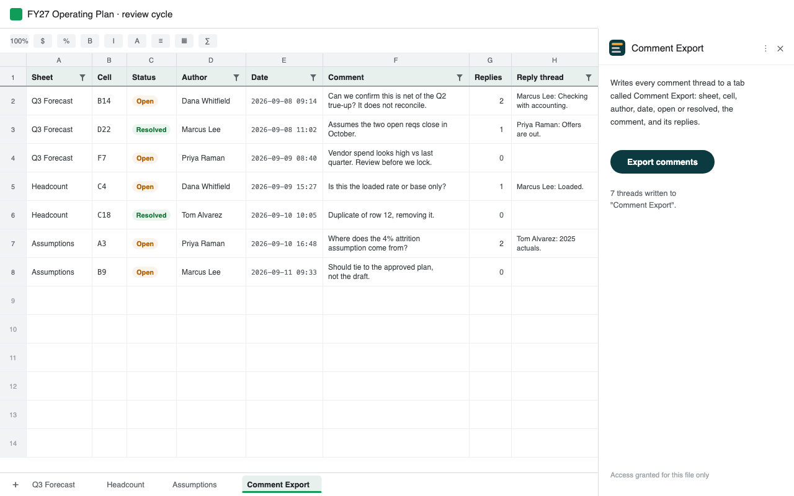

# Comment Export for Sheets

A Google Workspace add-on that writes every comment in a spreadsheet to a tab you can sort.



Google Sheets keeps comments somewhere you cannot sort them, count them, or get them out.
If your review cycle happens in the comments, there is no way to answer "how many are still
open" or "which ones are on the forecast tab" without opening them one at a time.

Press one button and this adds a sheet called **Comment Export**, one row per thread:

| Sheet | Cell | Status | Author | Date | Comment | Replies | Reply thread |
|-------|------|--------|--------|------|---------|---------|--------------|

It arrives with a filter applied and the header frozen, ordered the way the spreadsheet
reads: tab by tab, then down the rows and across the columns. After that it is ordinary
spreadsheet data, and Sheets sorts and filters it better than any sidebar would.

Rerunning refreshes the tab in place. It never modifies, resolves or deletes your comments.

## How it works, and why it is not the obvious way

The obvious way is the Drive comments API. That turns out not to work, and the reason is
worth writing down because it is not documented anywhere I could find.

`comments.list` will tell you what a comment says, who wrote it, when, and whether it is
resolved. It will not tell you **where it is**. The anchor it returns for a Sheets comment
looks like this:

```json
{"type":"workbook-range","uid":0,"range":"761099952"}
```

That `range` is an opaque internal id. It matches no sheet id, carries no row or column,
and resolves to nothing reachable from any public API. So the single most useful field,
which cell the comment is attached to, is unrecoverable by that route.

The `.xlsx` export does carry it. `files.export` returns `xl/threadedComments/*` with the
cell reference, timestamp, author id, resolved flag and parent id all present:

```xml
<x18tc:threadedComment ref="B14" dT="2026-09-08T09:14:00.00"
    personId="{...}" id="{...}" done="0">
  <x18tc:text>Can we confirm this is net of the Q2 true-up?</x18tc:text>
</x18tc:threadedComment>
```

So the add-on asks Drive for the export, unzips it with Apps Script's built-in
`Utilities.unzip`, and reads the comment records out of the archive. No external library.

**One trap if you build something similar.** The part numbering is not the sheet numbering.
`threadedComment2.xml` was the *third* tab in testing. The only reliable mapping is:

```
workbook.xml  ->  r:id
              ->  workbook.xml.rels       ->  worksheets/sheetN.xml
              ->  that sheet's own .rels  ->  the threadedComments part
```

Index-matching the parts to the sheets will silently attribute comments to the wrong tab.

## Access model

Three scopes, all non-sensitive, which keeps this out of restricted-scope security review:

| Scope | Why |
|---|---|
| `drive.file` | Read the one file you grant, and only that file |
| `spreadsheets.currentonly` | Write the output tab |
| `script.external_request` | Call the Drive export endpoint |

Access is granted **per file**, through `requestFileScopeForActiveDocument()`. The add-on
is never given permission to your Drive. `urlFetchWhitelist` in the manifest pins the only
reachable host to the Drive files endpoint, so the claim that nothing else is contacted is
enforced rather than promised.

There is no server. Your comments go from your spreadsheet, through Google's own
infrastructure, back into your spreadsheet.

Worth knowing: Drive answers **404, not 403**, when `drive.file` has no grant on a file.
That is deliberate, so the API cannot be used to probe whether a file exists, and it means
"not found" should be handled as "ask for access again".

## Limits

- It reads **comments**. Notes are a separate Sheets feature and do not appear.
- `files.export` caps at 10MB, so a very large workbook will not run. You get a message
  rather than a silent failure.

## Install

Three files, pasted into a standalone Apps Script project:

- `appsscript.json`: manifest, scopes, add-on surfaces, url whitelist
- `Code.gs`: the card UI and the file-scope handshake
- `Comments.gs`: export, unzip, parse, write

Then Deploy → Test deployments → Install, and open a Sheet.

To publish it yourself you will need a standard Cloud project with the **Drive API** and the
**Google Workspace Marketplace SDK** enabled. Enabling the Drive advanced service inside
Apps Script enables it on whatever project is attached *at that moment*; switching projects
later does not carry it over, which is worth knowing before you spend an evening on it.

## License

MIT. See [LICENSE](LICENSE).

Built by [Benjamin J. Sunter](https://bensunter.com/). Write-up at
[bensunter.com/comment-export.html](https://bensunter.com/comment-export.html).
